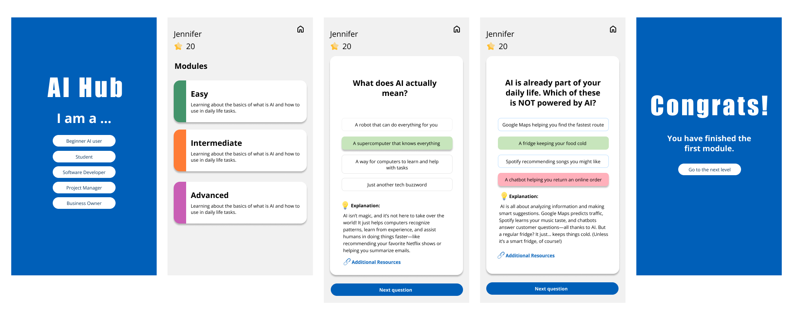

# Industry Project - AI Hub

## Problem Space

_How Might We Support Microsoft Customers in Adapting to AI Innovations?_

_Right now, AI can feel overwhelming for a lot of people. It’s new, evolving fast, and often comes wrapped in complex terminology._

## Solution

**AI Trivia Hub – a gamified, interactive learning tool**

### Why Trivia?

- **Breaks Down AI Jargon**: Many find AI complex. Trivia explains AI concepts and resources in a simple, engaging way that builds familiarity.
- **Creates a Safe Space to Learn**: No pressure, just interactive, low-stakes learning.
- **Gamified Learning**: Research indicates that gamified, interactive learning tools, such as trivia questions, can make learning new topics more approachable and effective.

### UI Design

